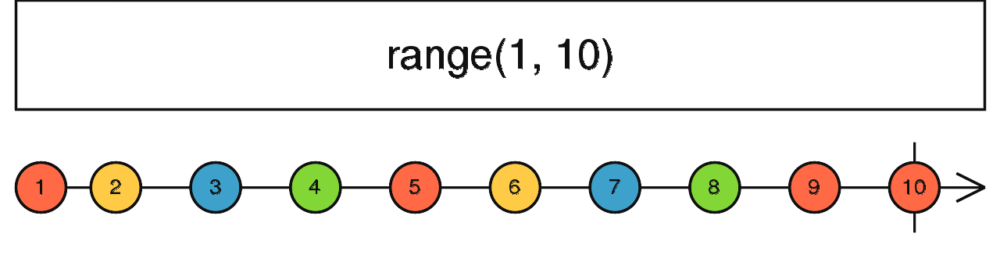
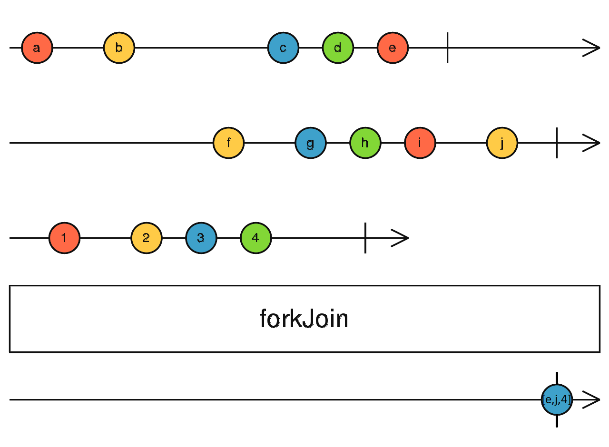
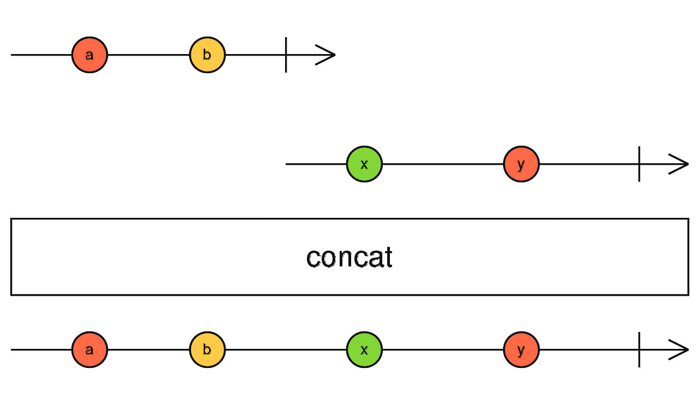
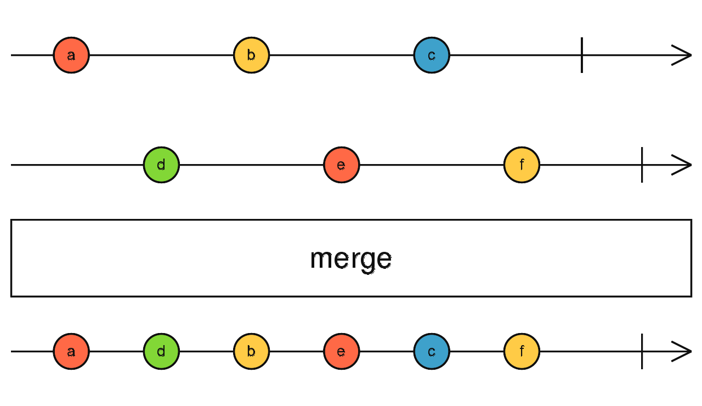
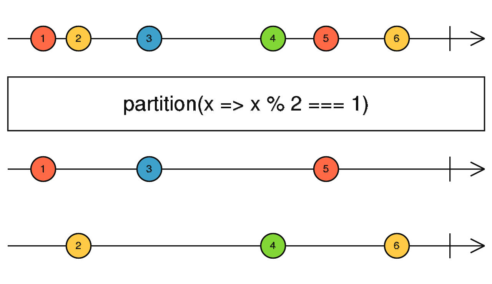
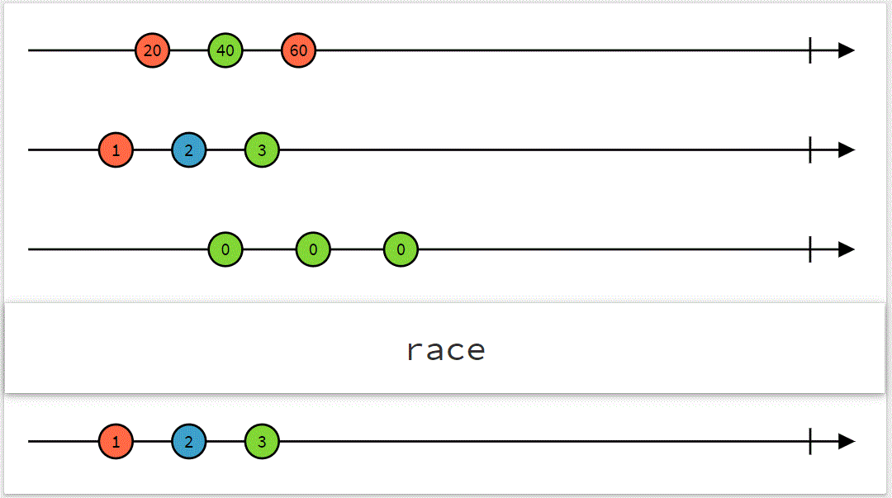

# rxjs

- provide operators to handle asynchronous code
-

## Subscription lifecycle

## Teardown logic when Observable completes

        const observable$ = new Observable<string>(subscriber => {
            console.log('Observable executed');
            subscriber.next('Alice');
            subscriber.next('Ben');
            setTimeout(() => {
                subscriber.next('Charlie');
                subscriber.complete();
            }, 2000);

            return () => {
                console.log('Teardown');  // this runs atlast when complete/unsubscribes or error notification is triggered
            };
        });

        console.log('Before subscribe');
        observable$.subscribe({
            next: value => console.log(value),
            complete: () => console.log('Completed')
        });
        console.log('After subscribe');

        // output
        Before subscribe
        Observable executed
        Alice
        Ben
        After subscribe
        Charlie
        Completed
        Teardown

## Teardown logic when Observable error out

        const observable$ = new Observable<string>(subscriber => {
            console.log('Observable executed');
            subscriber.next('Alice');
            subscriber.next('Ben');
            setTimeout(() => {
                subscriber.next('Charlie');
            }, 2000);
            setTimeout(() => subscriber.error(new Error('Failure')), 4000);

            return () => {
                console.log('Teardown');  // this runs atlast when complete/unsubscribes or error notification is triggered
            };
        });

        console.log('Before subscribe');
        observable$.subscribe({
            next: value => console.log(value),
            error: err => console.log(err.message),
            complete: () => console.log('Completed')
        });
        console.log('After subscribe');

        //
        Before subscribe
        Observable executed
        Alice
        Ben
        After subscribe
        Charlie
        Failure
        Teardown

## Unsubscribe & teardown importance

        const interval$ = new Observable<number>(subscriber => {
            let counter = 1;

            const intervalId = setInterval(() => {
                console.log('Emitted', counter);
                subscriber.next(counter++);
            }, 2000);

            return () => {
                clearInterval(intervalId);  // if teardown is not written to clear the setInterval, the observable would not able
                                            // emitted any value but setInterval logs would have still printed
            };
        });

        const subscription = interval$.subscribe(value => console.log(value));

        setTimeout(() => {
            console.log('Unsubscribe');
            subscription.unsubscribe();
        }, 7000);

        // output without teardown
        Emitted 1
        1
        Emitted 2
        2
        Emitted 3
        3
        Unsubscribe
        Emitted 4
        Emitted 5
        Emitted 6
        so on...

        // output with teardown
        Emitted 1
        1
        Emitted 2
        2
        Emitted 3
        3
        Unsubscribe

## HOT vs COLD Observable

| Hot Observable                        | Cold Observable                             |
| ------------------------------------- | ------------------------------------------- |
| Multicast the data from common source | Produces the data inside                    |
| All subscribers common data           | new Subscriber will have new data           |
| eg:- DOM event, State, Subject        | set of values, HTTP request, Timer/Interval |

# Creation Function

## 1. of

- `Converts the arguments to an observable sequence`.
- Each argument becomes a next notification

        of(10,20,30).subscribe(val => console.log(val))
        output
        10
        20
        30

        of([10,20,30]).subscribe(val => console.log(val))
        output
        [10,20,30]

- `polyfill of operator`

        function ourOwnOf(...args: string[]): Observable<string> {
            return new Observable<string>(subscriber => {
            for(let i = 0; i < args.length; i++) {
                subscriber.next(args[i]);
            }
                subscriber.complete();
            });
        }

## 2. from

- `Creates an Observable from an Array, an array-like object,`
  - array
  - a Promise,
  - an iterable object,
  - an Observable-like object.
- Converts almost anything to an Observable

        from([10,20,30]).subscribe(val => console.log(val))
        output
        10
        20
        30

## 3. fromEvent

- Creates an Observable that emits events of a specific type coming from the `given event target`

        const triggerButton = document.querySelector('button#trigger');

        const subscription = fromEvent<MouseEvent>(triggerButton, 'click').subscribe(
            event => console.log(event.type, event.x, event.y)
        );

- polyfill for fromEvent

        const triggerClick$ = new Observable<MouseEvent>(subscriber => {
            const clickHandlerFn = event => {
                console.log('Event callback executed');
                subscriber.next(event);
            };

            triggerButton.addEventListener('click', clickHandlerFn);

            // super imp as unsubscribing doesn't clear the click event
            // teardown will be run when unsubscribe/complete/error notification is triggered
            return () => {
                triggerButton.removeEventListener('click', clickHandlerFn);
            };
        });

        const subscription = triggerClick$.subscribe(
            event => console.log(event.type, event.x, event.y)
        );

        setTimeout(() => {
            console.log('Unsubscribe');
            subscription.unsubscribe();
        }, 5000);

## 4. timer

- internally works same same setTimer
- unsubscribing leads to cleaning of all events, intervals all cleanup

        const timerRxjs$ = timer(200).subscribe({
            next: (value) => console.log(value),
            complete: () => console.log(' timer rxjs complete'),
        });

        setTimeout(() => timerRxjs$.unsubscribe(), 3000);

- polyfill for timer

        const timer$ = new Observable<number>((subscriber) => {
            const timeoutId = setTimeout(() => {
                console.log('Timeout!');
                subscriber.next(0);
                subscriber.complete();
            }, 2000);

            // super imp as unsubscribing doesn't clear the click event
            // teardown will be run when unsubscribe/complete/error notification is triggered
            return () => clearTimeout(timeoutId);
        });

        const subscription = timer$.subscribe({
            next: (value) => console.log(value),
            complete: () => console.log('Completed'),
        });

        setTimeout(() => {
            subscription.unsubscribe();
            console.log('Unsubscribe');
        }, 1000);

## 4. interval

- internally works same same setInterval
- unsubscribing leads to cleaning of all events, intervals all cleanup

        const intervalRxjs$ = interval(1000).subscribe({
            next: (value) => console.log(value++),
            complete: () => console.log(' interval rxjs complete'),
        });

        setTimeout(() => intervalRxjs$.unsubscribe(), 3000);

- polyfill for interval

        const interval$ = new Observable<number>((subscriber) => {
            let counter = 0;

            const intervalId = setInterval(() => {
                console.log('Timeout!');
                subscriber.next(counter++);
            }, 1000);

            // super imp as unsubscribing doesn't clear the click event
            // teardown will be run when unsubscribe/complete/error notification is triggered
            return () => clearInterval(intervalId);
        });

        const subscription = interval$.subscribe({
            next: (value) => console.log(value),
            complete: () => console.log('Completed'),

        });

        setTimeout(() => {
            subscription.unsubscribe();
            console.log('Unsubscribe');
        }, 5000);

## 5. range(start,end)

- `Creates an Observable that emits a sequence of numbers within a specified range.`

        const numbers = range(1, 3);
        numbers.subscribe({
            next: value => console.log(value),
            complete: () => console.log('Complete!')
        });

        // Logs:
        // 1
        // 2
        // 3
        // 'Complete!'

# Join Creation Operators

## 1. forkJoin(...args: any[]): Observable<any>

- `Accepts an Array of ObservableInput or a dictionary Object of ObservableInput` and
- returns an Observable that emits either an array of values in the exact same order as the passed array, or a dictionary of values in the same shape as the passed dictionary.
- `Wait for Observables to complete and then combine last values they emitted; complete immediately if an empty array is passed.`

        const randomName$ = ajax('https://random-data-api.com/api/name/random_name');
        const randomNation$ = ajax('https://random-data-api.com/api/nation/random_nation');
        const randomFood$ = ajax('https://random-data-api.com/api/food/random_food');

        forkJoin([randomName$, randomNation$, randomFood$]).subscribe(
            ([nameAjax, nationAjax, foodAjax]) => console.log(`${nameAjax.response.first_name} is from ${nationAjax.response.capital} and likes to eat ${foodAjax.response.dish}.`)
        );

- `if any of the observable passed errors out, forkJoin will not wait for other subs to complete.`

        const a$ = new Observable(subscriber => {
            setTimeout(() => {
                subscriber.next('A');
                subscriber.complete();
            }, 5000);

            return () => {
                console.log('A teardown');
            };
        });

        const b$ = new Observable(subscriber => {
            setTimeout(() => {
                subscriber.error('Failure!');
            }, 3000);

            return () => {
                console.log('B teardown');
            };
        });

        forkJoin([a$, b$]).subscribe({
            next: value => console.log(value),
            error: err => console.log('Error:', err)
        });

## 2. combineLatest

- Whenever any input Observable emits a value, it computes a formula using the latest values from all the inputs, then emits the output of that formula.
- it will wait for all the observables to emit first set of data, and on subsequent data emitted by any of the observable it will combine with the last emitted value fo the other observable, this will continue will all observables gets completed.

        const firstTimer = timer(0, 1000); // emit 0, 1, 2... after every second, starting from now
        const secondTimer = timer(500, 1000); // emit 0, 1, 2... after every second, starting 0,5s from now
        const combinedTimers = combineLatest([firstTimer, secondTimer]);
        combinedTimers.subscribe(value => console.log(value));
        // Logs
        // [0, 0] after 0.5s
        // [1, 0] after 1s
        // [1, 1] after 1.5s
        // [2, 1] after 2s

- `same as other rxjs, if any of the observable results in error, the combineLatest will produce error, stopping all observables.`

## 3. concat(...args)

- Creates an output Observable which `sequentially emits all values from the first given Observable and then moves on to the next.`
- Concatenates multiple Observables together by sequentially emitting their values, one Observable after the other.
- concat will subscribe to first input Observable and emit all its values, without changing or affecting them in any way. When that Observable completes, it will subscribe to then next Observable passed and, again, emit its values. This will be repeated, until the operator runs out of Observables. When last input Observable completes, concat will complete as well. At any given moment only one Observable passed to operator emits values

    const timer = interval(1000).pipe(take(4));
    const sequence = range(1, 10);
    const result = concat(timer, sequence);
    result.subscribe(x => console.log(x));

    // results in:
    // 0 -1000ms-> 1 -1000ms-> 2 -1000ms-> 3 -immediate-> 1 ... 10

## 4. merge(...args)

- Creates an output Observable which `concurrently emits all values from every given input Observable.`
- Flattens multiple Observables together by blending their values into one Observable.
- merge subscribes to each given input Observable (as arguments), and simply forwards (without doing any transformation) all the values from all the input Observables to the output Observable. The output Observable only completes once all input Observables have completed. Any error delivered by an input Observable will be immediately emitted on the output Observable.

        const clicks = fromEvent(document, 'click');
        const timer = interval(1000);
        const clicksOrTimer = merge(clicks, timer);
        clicksOrTimer.subscribe(x => console.log(x));

        // Results in the following:
        // timer will emit ascending values, one every second(1000ms) to console
        // clicks logs MouseEvents to console every time the "document" is clicked
        // Since the two streams are merged you see these happening
        // as they occur.

## 5. partition(source: Observable, predicate)

- `Splits the source Observable into two, one with values that satisfy a predicate, and another with values that don't satisfy the predicate.`
- It's like filter, but returns two Observables: one like the output of filter, and the other with values that did not pass the condition.
- partition outputs an array with two Observables that partition the values from the source Observable through the given predicate function. The first Observable in that array emits source values for which the predicate argument returns true. The second Observable emits source values for which the predicate returns false. The first behaves like filter and the second behaves like filter with the predicate negated.

          const observableValues = of(1, 2, 3, 4, 5, 6);
          const [evens$, odds$] = partition(observableValues, value => value % 2 === 0);

          odds$.subscribe(x => console.log('odds', x));
                  evens$.subscribe(x => console.log('evens', x));

          // Logs:
          // odds 1
          // odds 3
          // odds 5
          // evens 2
          // evens 4
          // evens 6

  

## 6. race(...observables)

- its like a race where the from the list of observable which emits the first will win and will continue till it completes, others are unsubscribed as soon as first will emit a value.
- race returns an observable, that when subscribed to, subscribes to all source observables immediately. `As soon as one of the source observables emits a value, the result unsubscribes from the other sources`. The resulting observable will forward all notifications, including error and completion, from the "winning" source observable.
- `If one of the used source observable throws an errors before a first notification the race operator will also throw an error, no matter if another source observable could potentially win the race`.
- race can be useful for selecting the response from the fastest network connection for HTTP or WebSockets. race can also be useful for switching observable context based on user input

            const obs1 = interval(7000).pipe(map(() => 'slow one'));
            const obs2 = interval(3000).pipe(map(() => 'fast one'));
            const obs3 = interval(5000).pipe(map(() => 'medium one'));

            race(obs1, obs2, obs3)
            .subscribe(winner => console.log(winner));

            // Outputs
            // a series of 'fast one'

