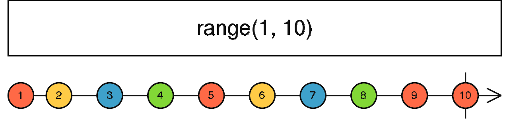

# Creation Function

## 1. of

- `Converts the arguments to an observable sequence`.
- Each argument becomes a next notification

        of(10,20,30).subscribe(val => console.log(val))
        output
        10
        20
        30

        of([10,20,30]).subscribe(val => console.log(val))
        output
        [10,20,30]

- `polyfill of operator`

        function ourOwnOf(...args: string[]): Observable<string> {
            return new Observable<string>(subscriber => {
            for(let i = 0; i < args.length; i++) {
                subscriber.next(args[i]);
            }
                subscriber.complete();
            });
        }

## 2. from

- `Creates an Observable from an Array, an array-like object,`
  - array
  - a Promise,
  - an iterable object,
  - an Observable-like object.
- Converts almost anything to an Observable

        from([10,20,30]).subscribe(val => console.log(val))
        output
        10
        20
        30

## 3. fromEvent

- Creates an Observable that emits events of a specific type coming from the `given event target`

        const triggerButton = document.querySelector('button#trigger');

        const subscription = fromEvent<MouseEvent>(triggerButton, 'click').subscribe(
            event => console.log(event.type, event.x, event.y)
        );

- polyfill for fromEvent

        const triggerClick$ = new Observable<MouseEvent>(subscriber => {
            const clickHandlerFn = event => {
                console.log('Event callback executed');
                subscriber.next(event);
            };

            triggerButton.addEventListener('click', clickHandlerFn);

            // super imp as unsubscribing doesn't clear the click event
            // teardown will be run when unsubscribe/complete/error notification is triggered
            return () => {
                triggerButton.removeEventListener('click', clickHandlerFn);
            };
        });

        const subscription = triggerClick$.subscribe(
            event => console.log(event.type, event.x, event.y)
        );

        setTimeout(() => {
            console.log('Unsubscribe');
            subscription.unsubscribe();
        }, 5000);

## 4. timer

- internally works same same setTimer
- unsubscribing leads to cleaning of all events, intervals all cleanup

        const timerRxjs$ = timer(200).subscribe({
            next: (value) => console.log(value),
            complete: () => console.log(' timer rxjs complete'),
        });

        setTimeout(() => timerRxjs$.unsubscribe(), 3000);

- polyfill for timer

        const timer$ = new Observable<number>((subscriber) => {
            const timeoutId = setTimeout(() => {
                console.log('Timeout!');
                subscriber.next(0);
                subscriber.complete();
            }, 2000);

            // super imp as unsubscribing doesn't clear the click event
            // teardown will be run when unsubscribe/complete/error notification is triggered
            return () => clearTimeout(timeoutId);
        });

        const subscription = timer$.subscribe({
            next: (value) => console.log(value),
            complete: () => console.log('Completed'),
        });

        setTimeout(() => {
            subscription.unsubscribe();
            console.log('Unsubscribe');
        }, 1000);

## 4. interval

- internally works same same setInterval
- unsubscribing leads to cleaning of all events, intervals all cleanup

        const intervalRxjs$ = interval(1000).subscribe({
            next: (value) => console.log(value++),
            complete: () => console.log(' interval rxjs complete'),
        });

        setTimeout(() => intervalRxjs$.unsubscribe(), 3000);

- polyfill for interval

        const interval$ = new Observable<number>((subscriber) => {
            let counter = 0;

            const intervalId = setInterval(() => {
                console.log('Timeout!');
                subscriber.next(counter++);
            }, 1000);

            // super imp as unsubscribing doesn't clear the click event
            // teardown will be run when unsubscribe/complete/error notification is triggered
            return () => clearInterval(intervalId);
        });

        const subscription = interval$.subscribe({
            next: (value) => console.log(value),
            complete: () => console.log('Completed'),

        });

        setTimeout(() => {
            subscription.unsubscribe();
            console.log('Unsubscribe');
        }, 5000);

## 5. range(start,end)

- `Creates an Observable that emits a sequence of numbers within a specified range.`

        const numbers = range(1, 3);
        numbers.subscribe({
            next: value => console.log(value),
            complete: () => console.log('Complete!')
        });

        // Logs:
        // 1
        // 2
        // 3
        // 'Complete!'

