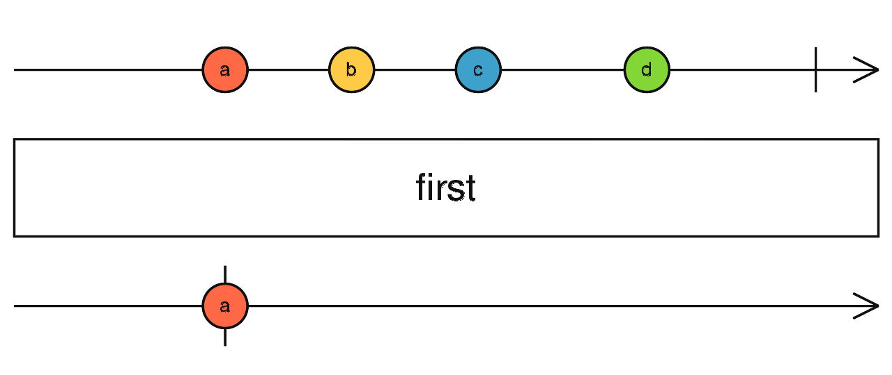
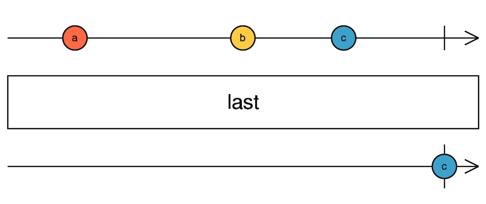
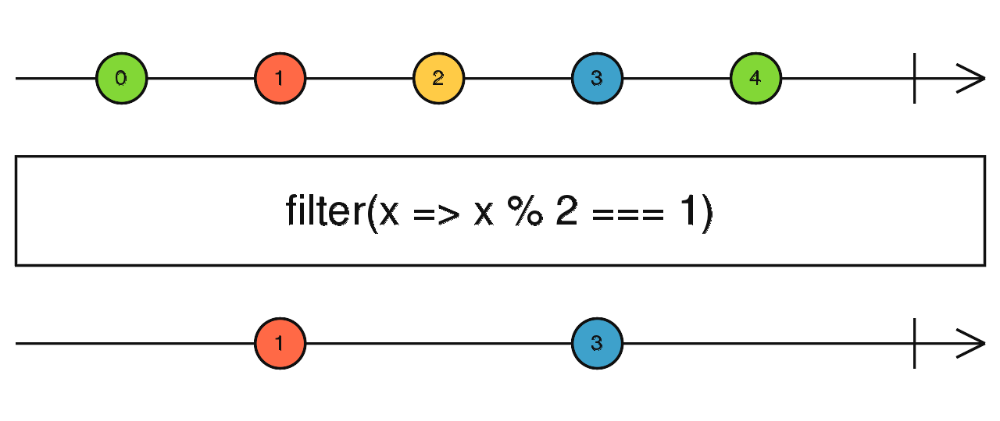
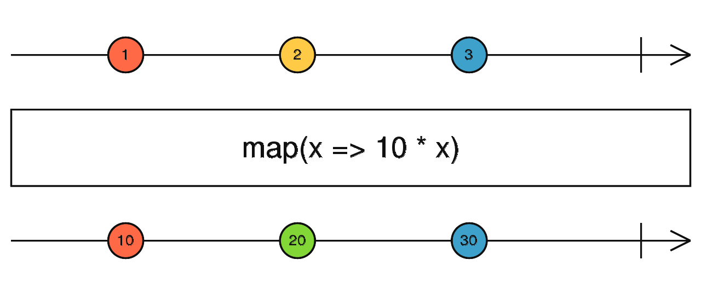
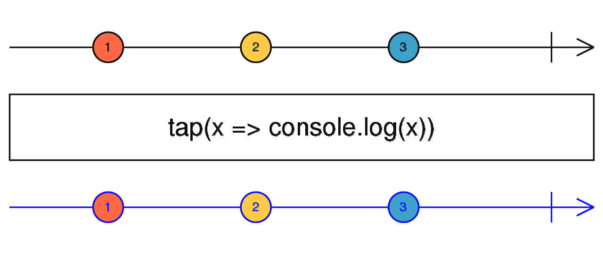
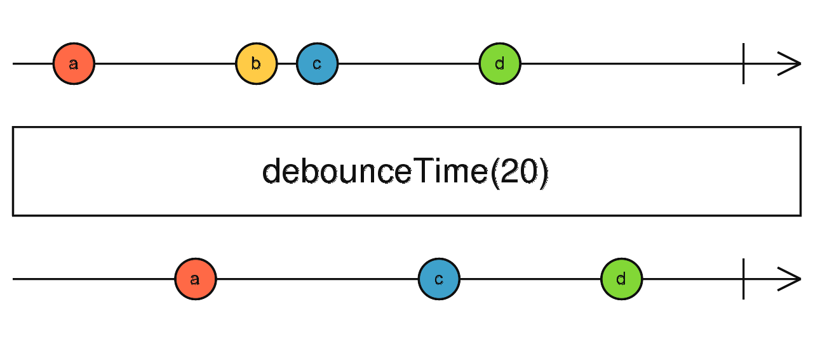
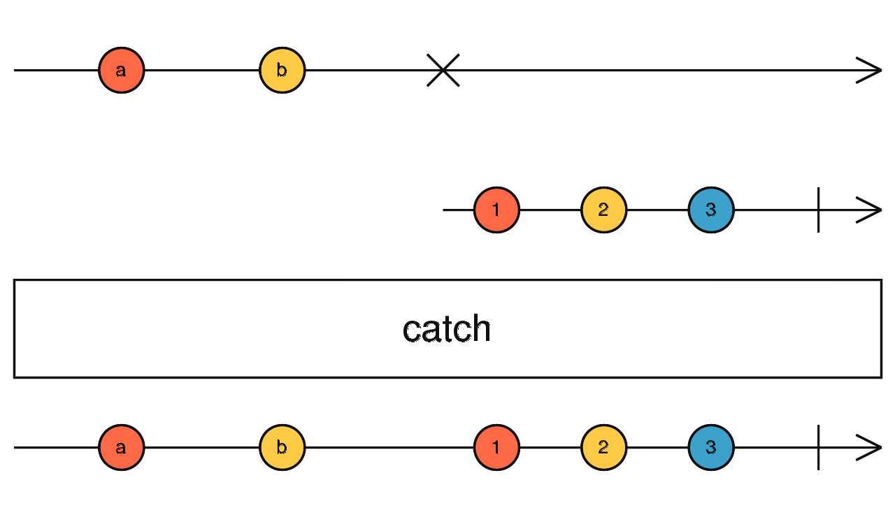

# Filtering operators

## 1. first(predicate?, defaultValue?: any)

- `Emits only the first value (or the first value that meets some condition) emitted by the source Observable.`
- Emits only the first value. Or emits only the first value that passes some test.

            const clicks = fromEvent(document, 'click');
            const result = clicks.pipe(first());
            result.subscribe(x => console.log(x));

            const clicks = fromEvent(document, 'click');
            const result = clicks.pipe(first(ev => (<HTMLElement>ev.target).tagName === 'DIV'));
            result.subscribe(x => console.log(x));

## 2. last(predicate?, defaultValue?: any)

- Returns an `Observable that emits only the last item emitted by the source Observable`.
- It `optionally takes a predicate function as a parameter, in which case, rather than emitting the last item from the source Observable`, the resulting Observable will emit the last item from the source Observable that satisfies the predicate.
- It will emit an error notification if the source completes without notification or one that matches the predicate.
- It returns the last value or if a predicate is provided last value that matches the predicate.
- It returns the given default value if no notification is emitted or matches the predicate.

            const source = from(['x', 'y', 'z']);
            const result = source.pipe(last());
            result.subscribe(value => console.log(`Last alphabet: ${ value }`));
            // Outputs
            // Last alphabet: z

            const source = from(['x', 'y', 'z']);
            const result = source.pipe(last(char => char === 'a', 'not found'));
            result.subscribe(value => console.log(`'a' is ${ value }.`));
            // Outputs
            // 'a' is not found.

## 3. filter(predicate: (value: T, index: number))

- Filter items emitted by the `source Observable by only emitting those that satisfy a specified predicate.`
- Like Array.prototype.filter(), `it only emits a value from the source if it passes a criterion function.`
- this operator takes values from the source Observable, passes them through a predicate function and only emits those values that yielded true.

            const div = document.createElement('div');
            div.style.cssText = 'width: 200px; height: 200px; background: #09c;';
            document.body.appendChild(div);

            const clicks = fromEvent(document, 'click');
            const clicksOnDivs = clicks.pipe(filter(ev => (<HTMLElement>ev.target).tagName === 'DIV'));
            clicksOnDivs.subscribe(x => console.log(x));

## 4. map(projection|transform: (value:T, index: number))

- `it passes each source value through a transformation function to get corresponding output values.`
- this operator applies a projection to each value and emits that projection in the output Observable.

            const randomFirstName$ = ajax<any>('https://random-data-api.com/api/name/random_name').pipe(
                map(ajaxResponse => ajaxResponse.response.first_name)
            );

            const randomCapital$ = ajax<any>('https://random-data-api.com/api/nation/random_nation').pipe(
                map(ajaxResponse => ajaxResponse.response.capital)
            );

            const randomDish$ = ajax<any>('https://random-data-api.com/api/food/random_food').pipe(
                map(ajaxResponse => ajaxResponse.response.dish)
            );

            forkJoin([randomFirstName$, randomCapital$, randomDish$]).subscribe(
                ([firstName, capital, dish]) =>
                console.log(`${firstName} is from ${capital} and likes to eat ${dish}.`)
            );

            // output
            // Deanna is from Paris and likes to eat French Toast.

## 5. tap()

- Used to perform side-effects for notifications from the source observable
- used for debugging purpose
- below handlers rae present

  - next
  - complete
  - error
  - subscribe
  - unsubscribe
  - finalize

          of(1, 7, 3, 6, 2)
          .pipe(
              filter((value) => value > 5),
              map((value) => value * 2),
              tap({
                   next: (value) => console.log('Spy:', value),
                   complete: () => console.log('complete'),
                   error: () => console.log('error'),
                   subscribe: () => console.log('subscribe'),
                   unsubscribe: () => console.log('unsubscribe'),
                   finalize: () => console.log('finalize'),
              })
          )
          .subscribe((value) => console.log('Output:', value));

            // output
            subscribe
            Spy: 14
            Output: 14
            Spy: 12
            Output: 12
            complete
            finalize

## 6. debounceTime [rate-limiting-operator]

- Emits a notification from the source Observable only after a particular time span has passed without another source emission.
- debounceTime delays notifications emitted by the source Observable, but drops previous pending delayed emissions if a new notification arrives on the source Observable. This operator keeps track of the most recent notification from the source Observable, and emits that only when dueTime has passed without any other notification appearing on the source Observable. If a new value appears before dueTime silence occurs, the previous notification will be dropped and will not be emitted and a new dueTime is scheduled. If the completing event happens during dueTime the last cached notification is emitted before the completion event is forwarded to the output observable. If the error event happens during dueTime or after it only the error event is forwarded to the output observable. The cache notification is not emitted in this case.

## 7. catchError

- Catches errors on the observable to be handled by returning a new observable or throwing an error.
- `It only listens to the error channel and ignores notifications. Handles errors from the source observable, and maps them to a new observable`.
- `The error may also be rethrown, or a new error can be thrown to emit an error from the result.`
- This operator handles errors, but forwards along all other events to the resulting observable. If the source observable terminates with an error, it will map that error to a new observable, subscribe to it, and forward all of its events to the resulting observable

        of(1, 2, 3, 4, 5)
        .pipe(
            map(n => {
            if (n === 4) {
                throw 'four!';
            }
            return n;
            }),
            catchError(err => of('I', 'II', 'III', 'IV', 'V'))
        )
        .subscribe(x => console.log(x));
        // 1, 2, 3, I, II, III, IV, V

        of(1, 2, 3, 4, 5)
        .pipe(
            map(n => {
            if (n === 4) {
                throw 'four!';
            }
            return n;
            }),
            catchError(err => {
            throw 'error in source. Details: ' + err;
            })
        )
        .subscribe({
            next: x => console.log(x),
            error: err => console.log(err)
        });
        // 1, 2, 3, error in source. Details: four!

