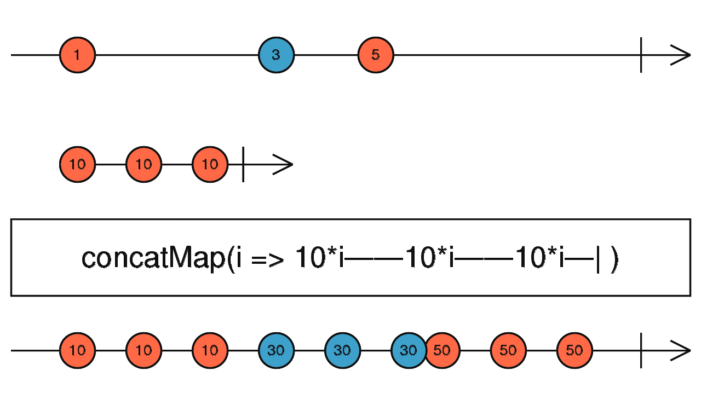

# Flattening Operators

- the main difference is how `each flattening operator handle concurrency of outer observable`
- `all inner subscription should get complete to avoid memory leaks`

## 1. concatMap

- When outer observable emits a value, this goes to concatMap which creates inner observable
- `until inner observable gets complete notification the outer next emit value would not be processed by inner observable`
- benefits
  1. `guarantee sequential data`
  2. useful when the each future value emitted by outer observable depends on the last emitted value
- cons
  1. may lead to long wait time due to inner observable taking long time
- outcomes [`for all flattening operators`]

  1.  when inner observable emits notification [next]
      - the same is emitted as output
  2.  when inner observable emits notification [complete]
      - the complete notification of inner observable, indicates to take next notification [next] from the outer observable
  3.  when inner observable emits notification [error]

      - the error is passed to outer subscription and everything stops, no next notification is taken from outer observable

              const source$ = new Observable(subscriber => {
                  tTimeout(() => subscriber.next('A'), 2000);
                  (() => subscriber.next('B'), 5000);
              });

              console.log('App has started');
              source$.pipe(
                  concatMap(value => of(1, 2))
              ).subscribe(value => console.log(value));

              // output
              App has started
              1
              2
              1
              2

- Ways to avoid outer subs to fail when error notification is encountered from inner observable

  1.  `pass error to catchError operator using EMPTY`

      - as catchError will catch the error and EMPTY will just emits the complete notification
      - ISSUE WITH THIS APPROACH

        - `this will avoid error to be thrown to outer subscription`,
        - `but this will also lead to no further next notification from outer observable`

                fromEvent(fetchButton, 'click').pipe(
                    map(() => endpointInput.value),
                    concatMap(value =>
                        ajax(`https://random-data-api.com/api/${value}/random_${value}`)
                    ),
                    catchError(() => EMPTY)
                ).subscribe({
                    next: value => console.log(value),
                    error: err => console.log('Error:', err),
                    complete: () => console.log('Completed')
                });

  2.  `instead catchError as inner subscription`

  - this will replicate the initial behavior same as complete of inner observable using catchError with EMPTY/catch the error, to `avoid error reaching flattening logic which will end further value notification`

              fromEvent(fetchButton, 'click').pipe(
                  map(() => endpointInput.value),
                  concatMap(value =>
                      ajax(`https://random-data-api.com/api/${value}/random_${value}`)
                      .pipe(
                          catchError(error => of(`Could not fetch data: ${error}`))   // catch error at inner subscription
                      )
                  )
              ).subscribe({
                  next: value => console.log(value),
                  error: err => console.log('Error:', err),
                  complete: () => console.log('Completed')
              });

## 2. switchMap

- the only difference in switchMap is currency for handling outer observable data
- `it unsubscribes the current running inner observable if new data comes from outer Observable before the inner observable send complete notification` and as the name is `switch, it takes the new outer observable data and creates new inner observable and subscribes`
- rest error related behavior is same as of concatMap
- same as switch but has inner subs logic

## 3. mergeMap

- `here all the outer subscription emitted values creates inner subscription as and when new value is emitted by outer observable irrespective of inner subs completion and the inner subscription keep emitting values to outer subscription as and when they gets it until inner subs gives complete notification`
- same as merge but has inner subs logic
- cons
  1. `easy to create large memory leaks as parallel inner subs are created`
  2. `responses will come in unordered way as parallel inner subs gets created`
- remember to see all inner subs complete to avoid memory leaks

| concatMap                                       | switchMap                                                 | mergeMap                    |
| ----------------------------------------------- | --------------------------------------------------------- | --------------------------- |
| queues / buffer                                 | cancels/ unsubscribe                                      | concurrent                  |
| memory leaks easy to notice                     | memory leaks not dangerous [only one inner sub at a time] | memory leaks hard to notice |
| values handled one by one                       | Quick reaction to new source value                        |                             |
| possible delayed reaction & order is maintained | order is safe                                             | no definite order           |
